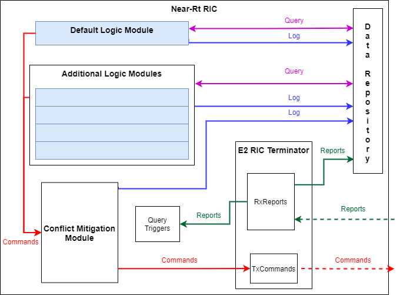
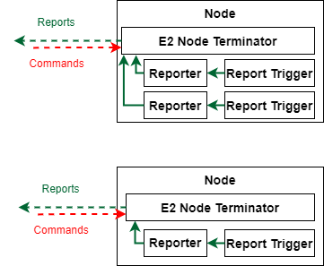
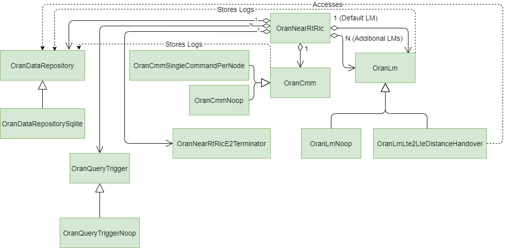
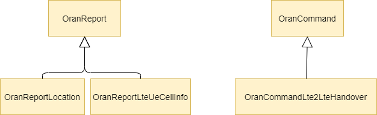
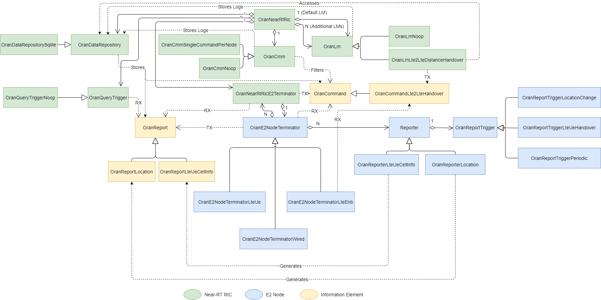
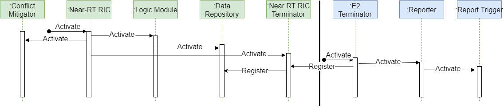
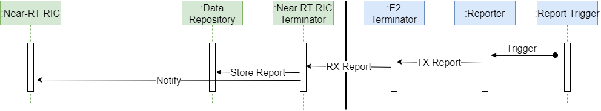
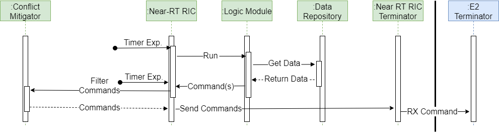

.. include:: replace.txt
.. highlight:: cpp

O-RAN Model Architecture
------------------------

Design
******

The design of the ``oran`` model can be divided into the components that comprise the Near-RT RIC, and the components that attach to the simulation nodes (E2 Nodes) for Reporting and Command processing.

Near-RT RIC Design
==================
The Near-RT RIC is modeled as a container that houses all the individual components that provide the different functionalities of the RIC:

- Data storage.
- Logic processing modules. A ``default`` module must always be defined, and any number of additional modules can be deployed.
- Conflict mitigation.A
- Report triggers to start querying the logic processing modules based on report types and contents.
- Communication with the simulation nodes.

The block diagram of the Near-RT RIC model can be seen in this figure:

The Near-RT RIC is used to define and configure the specific instance of each of the components that will be used. By doing this, each of the components can be instantiated independently, and the Near-RT RIC will take care of either providing them with the pointers to the components they need to use (in the case of the data storage), or pass the information from one to another (like passing the Commands generated by the logic processing modules to the Conflict Mitigation instance). Additionally, the Near-RT RIC can activate or deactivate all the instantiated components when the RIC itself gets activated or deactivated.

The data repository model serves as the access point to the actual storage instance. This approach serves to abstract the details of the storage implementation, so the rest of the components of the Near-RT RIC do not need to know whether they are accessing a database, a text file, or any other storage structure. This abstraction also serves as a single-point definition of the data access API that will be implemented by the storage instances. This ensures that all the other components will work the same from one simulation to another, regardless of the storage mechanism used.

The operations defined by the data access API can be grouped into the following categories:

- **Report Storage**: for storing the registration requests and Reports sent by the nodes.
- **Network Status Query**: for retrieving the information stored from the nodes' Reports.
- **Logging**: for storing logic log messages and outputs generated by the logic processing and conflict mitigation modules.

The logic processing modules (abbreviated as Logic Modules, or LMs) are the components that implement the intelligence of the RIC. Each LM implements a different logic for issuing Commands to nodes depending on the status of the network retrieved from the data storage. Different LMs may try to optimize different metrics, or they may use different approaches and techniques for addressing the same specific issue. LMs use the data storage to retrieve the information reported by the network nodes, and based on the logic they implement, they generate sets of Commands for the network nodes that will help achieve the goal defined in their logic. LMs can optionally log the relevant steps of their logic to the data repository for later evaluation and / or debugging.

The LMs do not decide when their code is run. This is the decision of the Near-RT RIC that will query all the deployed LMs for the sets of Commands they want to issue. The Near-RT RIC may perform this invocation periodically at fixed intervals, or it may be triggered by a report received from an E2 Node. A query trigger is a filter that can specity a type of report and a value (or values) that, when received by the Near-RT RIC, can cause the LMs to be queried. When this happens, the timer for the periodic querying is restarted.

Each LM simulates the processing time required to run its logic using a Random Variable. When an LM is queried, the model runs its logic, generates the relevant Commands, and then waits the specified amount of time before sending a signal that indicates to the Near-RT RIC that it has finished processing and any generated commands are ready for retrieval. Meanwhile, after initiating the LM query (or queries), the Near-RT RIC starts a timer that specifies the maximum amount of time it will wait for the LMs to run their logic. If all the LMs complete their runs before the timer expires, the Near-RT RIC cancels the timer, and sends the collected Commands to the Conflict Mitigation Module. On the other hand, if the timer expires and some LMs are still in the ``processing`` state, then the Near-RT RIC sends the Commands that were collected from the LMs that finished on time (if any) to the Conflict Mitigation Module. If an LM finishes processing after the timer expires but before the next query starts, then the Near-RT RIC will save the Commands for the next run or discard them based on a configurable policy. Note that if the Commands are saved for the next run, it is possible that the set of Commands sent to the Conflict Mitigation Module contains Commands from a single LM generated from two different runs. It is the Conflict Mitigation module's reponsibility to handle these Commands as desired.

The Near-RT RIC must always instantiate at least one of these Logic Modules, which serves as the ``default`` LM for the RIC. Additional LMs can be deployed as needed as long as the ``default`` LM is always present. LMs can be managed dynamically during the simulation, and they can be added, removed, replaced, and reconfigured. In the case of the ``default`` LM, removing the existing LM must be followed by the deployment of a new instance, or the RIC will abort the simulation due to not having a ``default`` LM.

The Conflict Mitigation Module is a component that processes all the Commands generated by the deployed LMs each time the RIC invokes their logic, in order to minimize the potential conflicts between them. This module is especially important when there is more than one LM deployed, as each LM generates its own set of Commands independently, without interacting with other LMs. The logic in this module can be as complex or simple as desired, ranging from simple checks regarding the types of Commands or the nodes affected by them, to deep evaluations of the nodes and neighbors affected by the changes triggered by the Commands. The output of this process is a single set of Commands that will be sent to the relevant nodes in the network.

The final component of the RIC is the E2 Terminator. This module receives its name from the O-RAN architecture design, as the interface defined in those specifications is named ``E2``, and the components in the RIC and nodes that use said interface are called ``Terminators``. In the RIC model, the E2 Terminator is the entity that interacts with the simulation nodes, receiving the Reports sent by these nodes, and sending each of the Commands output by the Conflict Mitigation Module to the target network node. Both the received Reports and the sent Commands will be stored in the data repository, so that they can be retrieved later. For example, this information could be accessed by an LM to perform its logic or by a user in order to monitor or debug certain behavior.

All of these components can be activated and deactivated individually, or as a group. When a component is deactivated and another component tries to interact with it, the simulation is not aborted, but a ``no action`` approach is followed: the models will skip the actions they would normally perform and if any output is expected, empty sets or invalid values will be returned. For example, attempting to store a Report in a deactivated data storage will result in the Report being silently ignored, while passing sets of Commands to a deactivated Conflict Mitigation Module will result in all those Commands being returned right away, without any evaluation of possible conflicts.

Node Design
===========

The modules that enable a simulation node to interact with the Near-RT RIC are: An E2 Terminator, and Reporters. This is depicted in the next figure:

The Reporters are modules that attach to existing traces in the node, build Reports with the values being traced, and send them to the E2 Terminator in the node for transmission to the RIC. Each Reporter has an associated Report Trigger that tells the Reporter when to collect the information and generate the Report. These triggers may be periodic, or based on events or traces. Each Report includes the identity of the node, and the time at which it is generated, so even if the transmission to the RIC is delayed, the RIC will know the time at which the values in the Report were captured. When a Reporter is instantiated, it is linked to an E2 Terminator in the node, which allows the Reporter to obtain the node identity from the Terminator, and the Terminator to collect the Reports generated by the Reporter.

The E2 Terminator for the simulation nodes is analogous to the E2 Terminator in the RIC, in that it is the entity that communicates with the RIC by exchanging Reports and Commands. All of the E2 Terminators periodically send the Reports generated by the Reporters associated with it to the Near-RT RIC E2 Terminator. Additionally, the Node E2 Terminators are also in charge of receiving Commands from the RIC, and translating them into calls to the methods of the appropriate models. For example, an LTE handover Command will be translated into a call to start an X2 Handover in the associated eNB NetDevice instance. Due to the disparity of the Commands that may be accepted by each type of node, there are multiple instances of E2 Terminators, each one of them capable of processing a different set of Commands.

Communications Design
=====================

The communication between the Node E2 Terminators and the Near-RT RIC E2 Terminator is modeled using virtual interfaces. This means that there is no network link between these models, and instead, during the configuration, the E2 Terminators in the nodes are given a pointer to the RIC. With this pointer, the node Terminators will contact the RIC Terminator when they are activated, and this allows the RIC to keep track of all the node Terminators that are sending Reports and accepting Commands. Transmission delays for both Reports and Commands are simulated using Random Variables: one Random Variable in the E2 Terminator of the Near-RT RIC generates the delays for the Commands being sent to the E2 Nodes, and a Random Variable in each E2 Node Terminator generates the delays for the Reports being transmitted from the E2 Nodes to the Near-RT RIC.

The next figure shows all the components including the communication exchanges.

.. image:: figures/oran-design.png

Class Organization
******************

In this Section we will present the classes that have been used to model the O-RAN architecture according to the design previously presented. We will look at the classes in three groups: The RIC classes, the node classes, and the information exchange classes.

Near-RT RIC
===========

As we can see in the next figure

the class diagram can be easily mapped to the block diagrams presented earlier. Each functional module has been modeled with a parent class, that defines the API and interactions with other classes, and inheriting from the parent class are one or more child classes that provide specific implementations for each module.

The Data Repository class (``OranDataRepository``) defines the methods used by other components in the RIC to store and retrieve information in the RIC storage. An implementation of the storage module that uses SQLite as the backend (``OranDataRepositorySqlite``) inherits from this base class and implements all the data access methods by building up SQL commands and executing them against the database.

The Logic Module classes follow a similar principle, although the parent class (``OranLm``) actually implements methods that will be the same for all the implementations of LMs. For example, the methods used for activating and deactivating the module, retrieving the name, and logging messages, are all implemented in the parent class. This allows the instances to implement only the constructor, destructor, and logic method, as every other task is already taken care of. LMs make use of the Data Repository for retrieving information about the state of the network, and storing log messages and the generated Commands. In this release there are two specific instances of LMs: a 'No Operation' LM that does nothing (``OranLmNoop``), but serves to instantiate an LM when we must provide one, and an 'LTE handover' LM that issues Commands to handover an LTE UE from one LTE cell to another based on the distance from the LTE UE to the eNBs (``OranLmLte2LteDistanceHandover``).

A similar approach is taken for the Conflict Mitigation Module: the parent class (``OranCmm``) provides the implementation for all the common methods, and the specific implementations only need to implement their specific logic. The Conflict Mitigation modules access the Data Repository to log messages about their logic. Two implementations are provided in this release: a 'No Operation' implementation (``OranCmmNoop``), that does nothing, and a 'Single Command' implementation (``OranCmmSingleCommandPerNode``) that makes sure that in a single set we do not have more than one Command affecting the same node (if more than one Command affects the same node, the Command issued by the default LM takes precedence; otherwise, the first processed Command takes precedence).

The Near-RT RIC  also contains a collection (implemented as a C++ map) of Query Triggers that are used to start querying the LMs as soon as Reports with certain criteria reach the Near-RT RIC. The parent class for these Query Triggers is ``OranQueryTrigger``, and currently the only specific implementation is a No-Operation Trigger (``OranQueryTriggerNoop``) that never initiates the LM querying. The examples provided show how one can implemenet a custom Query Trigger based, for example, on Location Reports.

The Near-RT RIC E2 Terminator class (``OranNearRtRicE2Terminator``) is the only functional module that does not follow the same hierarchical design, as there are no different implementations to be provided. Therefore, the Near-RT RIC E2 Terminator class provides all the functionality needed for receiving Reports and node registration requests, storing these Reports and updating registration information in the Data Repository, receiving sets of Commands to send to nodes, logging these Commands in the Data Repository, and transmitting them to the appropriate nodes.

Finally, the Near-RT RIC class (``OranNearRtRic``) is the model that serves as a container for all the other functional models. A Near-RT RIC will contain an instance of the  Data Repository, an LM instance marked as ``default``, a vector of other additional LM instances, a Conflict Mitigation Module instance, and a Near-RT RIC E2 Terminator. Whenever one of these modules needs to access another, they will do so through the Near-RT RIC. This allows for dynamic replacement of the instances used during the simulation without having to update a significant number of references. Also, as the Near-RT RIC needs to ensure it keeps valid references to all the deployed instances, it will check that the references are valid whenever the RIC is activated and when it needs to invoke a method in the instances (for example, invoking the logic in the LMs). If any reference is found to be invalid or NULL, the simulation will be aborted.

O-RAN Nodes
===========

The classes used to model the node components of the architecture are shown in this figure

.. image:: figures/node-class.png

We can see how both components (the E2 Terminator and the Reporters) have been implemented following the same hierarchical principle as the Near-RT RIC components. Therefore, we have a parent Reporter class (``OranReporter``) that provides the implementation of the activation, deactivation, and generation of Reports to the E2 Terminator. This class is inherited by:

- The Location Reporter (``OranReporterLocation``), which can be attached to any ns-3 node, periodically retrieves the node's position through the node's Mobility Model.
- The LTE UE Cell Information Reporter (``OranReporterLteUeCellInfo``), which attaches to LTE UE nodes, and uses the LTE UE NetDevice to obtain the ID of the cell the UE is attached to.

Each Reporter class must have one Report Trigger (parent class ``OranReportTrigger``) that tells the Reporter when to collect the information. This is so that the Reporter knows how to get the information, and the Report Trigger knows when to get the information. The current release of the code includes a periodic Report Trigger (``OranReportTriggerPeriodic``), and two event-based Report Triggers: the ``OranReportTriggerLocationChange`` which is based on location events, and the ``OranReportTriggerLteUeHandover``, which is based on successul LTE handover events in a UE.

Similarly, the parent Node E2 Terminator class (``OranE2NodeTerminator``) provides the implementation for activating and deactivating, attaching to a node, adding Reporter instances, and sending periodic registration requests and Reports to the Near-RT RIC. These operations are the same for all specific instances of the Terminator. Where these instances will differ is in the Commands that they can process. Currently, implementations are provided of E2 Terminators for wired nodes (``OranE2NodeTerminatorWired``), LTE UEs (``OranE2NodeTerminatorLteUe``), and LTE eNBs (``OranE2NodeTerminatorLteEnb``).

Regarding the E2 Node periodic registration process, it is important to note that the Near-RT RIC performs periodic checks to identify E2 Nodes that have not updated their registration recently. If the last registration for an E2 Node in the Near-RT RIC's data repository is older than a configured threshold, the E2 Node will be considered deregistered, its Reports will be ignored, and it will not be issued any commands. It is therefore important to configure the registration timing adequately.

Information Elements
====================

The final group of classes are the ones used for the information exchange between the RIC and the nodes. They represent the Reports (parent class ``OranReport``) that the nodes generate and the RIC stores in the Data Repository, and the Commands (parent class ``OranCommand``) issued by the RIC's LMs and processed by the E2 Terminators in the nodes. These are shown in this figure:

The current release provides a Location Report (``OranReportLocation``), which contains node locality information, and an LTE UE Cell Information Report (``OranReportLteUeCellInfo``), which contains information about the cell to which the issuing LTE UE is attached.

Conversely, there is only one instance of Command distributed in this release, and that is the 'LTE to LTE Handover' Command (``OranCommandLte2LteHandover``). This Command instructs an eNB to handover one of the UEs attached to it (identified by its Radio Network Temporary Identifier (RNTI)) to another eNB. This Command must be processed by an LTE eNB E2 Terminator.

The next figure shows the interaction of all classes, as well as the Reporter instances that generate each Report instance, and the LTE eNB E2 Terminator being the one Terminator capable of processing the only available Command.

Utilities and Helpers
=====================

In addition to all the classes presented, the current distribution includes a Helper (``OranHelper``) that eases the code burden on the scenarios for configuring and deploying the individual models, and a Node E2 Terminator Container (``OranE2NodeTerminatorContainer``) that allows the activation and deactivation of multiple Node E2 Terminators with a single Command.

O-RAN Model Operation
*********************

This Section documents the sequence of events generated by the most common operations of the O-RAN models during a simulation: activation of the models, reporting from the nodes to the RIC, LM logic invocation in the RIC, and Command issuing from the RIC to the nodes.

Activation
==========

As shown in the next figure, when the Near-RT RIC is activated using its public API, the activation Command is propagated to the rest of the components: Data Repository, Logic Modules (default and additional), Conflict Mitigation Module, and E2 Terminator.

On the nodes' side, the activation of the E2 Terminator will trigger the activation of all the Reporters and Report Triggers attached to it, and it also triggers a registration request to the RIC. If the RIC has already been activated, the registration request will be recorded in the Data Repository. If the RIC is not active at this time, the registration request will be ignored, and periodic retransmissions of the request will be scheduled in the Node E2 Terminator.

Report Generation
=================

Once the RIC and a Node E2 Terminator have been activated, and a registration request has been successfully recorded in the Data Repository, the Report Triggers in the node will signal when the Reporters should generate Reports and send them to the Node E2 Terminator. In this Node E2 Terminator, a timer will periodically send the collected Reports to the RIC. When the RIC's E2 Terminator receives these Reports, they will be stored in the Data Repository, as shown in the next figure, and the Near-RT RIC will be notified so that the Query Triggers can be checked against the received Reports.

RIC Logic Execution
===================

The next figure shows how, the run of the logic of the LMs in the Near-RT RIC can be triggered by a periodic timer, or by a Query Trigger matching a received Report. In either case, the RIC will request to all the deployed LMs (default and additional) to run their logic and generate Commands for the network nodes. For each LM to process this request, it will retrieve information from the Data Storage about the network it is interested in (e.g. the positions of all the nodes in the last 10 seconds, the average traffic loss rate in the last 5 seconds, or the list of all the cells that each UE has been attached to), and use this information to decide, based on the logic and goals implemented, if any change needs to be made to the network, and if so, the appropriate Commands are issued. These commands will be passed to the Near-RT RIC once a processing timer expires in the LM.

.. image:: figures/seq-logic.png

Issuing of Commands
===================

After all the LMs have run their logic and generated their sets of Commands, or a maximum processing timer has expired in the Near-RT RIC, all collected Commands are sent to the Conflict Mitigation Module, which filters all of the Commands according to the logic implemented, and issues a single set of Commands ready to be sent to the nodes. This set is passed to the Near-RT RIC E2 Terminator which will log the individual Commands in the Data Storage, and then send each one of them to the appropriate E2 Terminator in the nodes. This sequence is show in the next figure.

